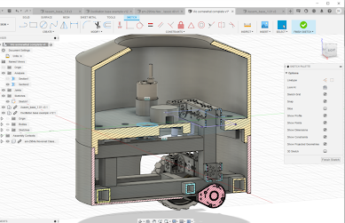
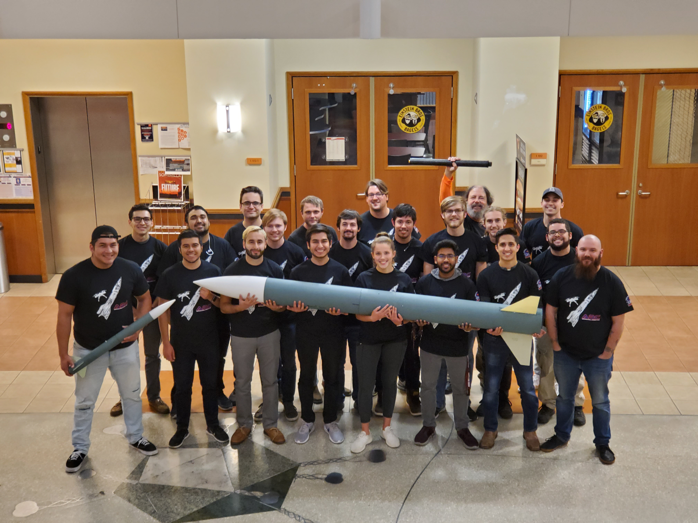
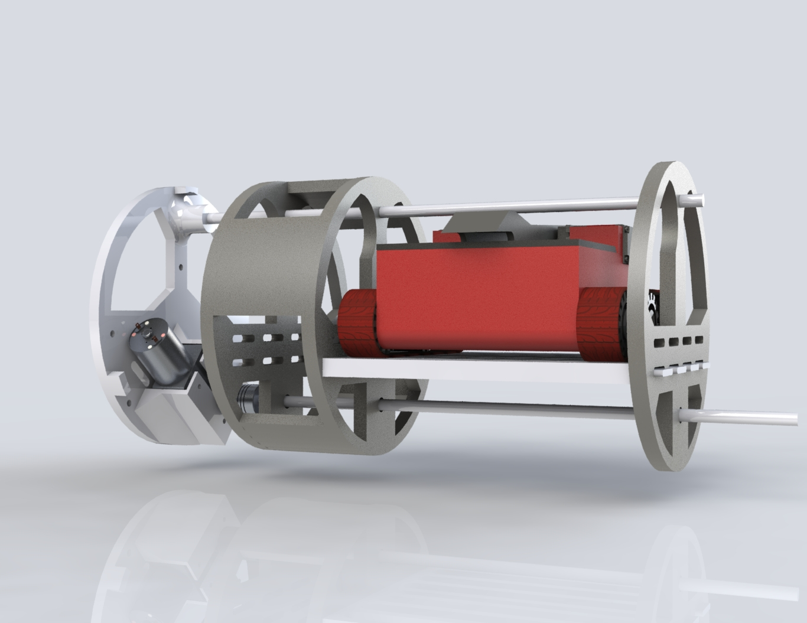
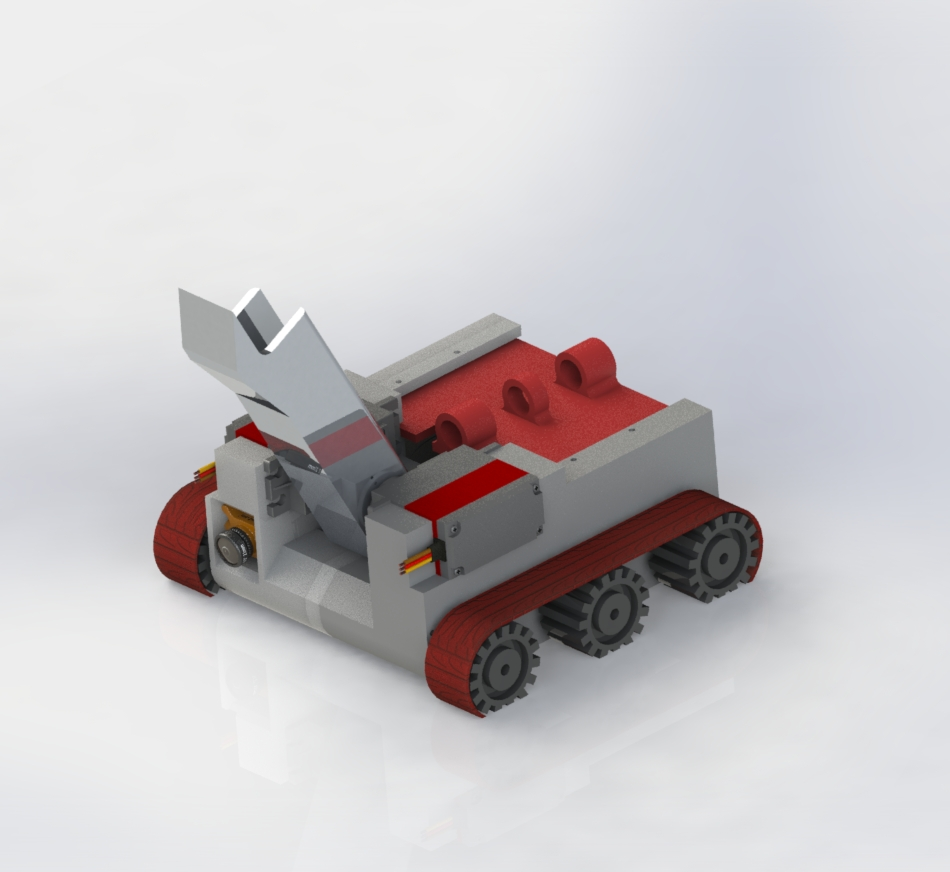

# CURRENT PROJECTS

## Sawppy Rover 
\
Sawppy, originating from the acronym SAWPIFE, Which stands for Servo Actuated Wheels Printed Interconnect For Extrusion, is an open-source motorized robot whose layout and proportion mimics that of the Curiosity and Perserverence Mars rovers. This design faithfully reproduces the suspension kinematics of real rovers and is intended to be a hardware platform for future software projects in autonomous operation. If you'd like to learn more about our ongoing open source project, please visit [Roger Random's Github page](https://github.com/Roger-random/Sawppy_Rover) \

## Project VIO 
\
The VIO project is an autonomous fan/heater hybrid that will follow a person in real-time as they move through the environment. The method of control for this design includes a mobile apprication developed by our team. The goal of the project is to aid a wheelshair user to always have a stable system by regulating the surrounding temperature as needed. \

# PAST PROJECTS

## NASA Student Launch
\
Words \
\
Words \
\

## Drone Catcher
\
Words \
