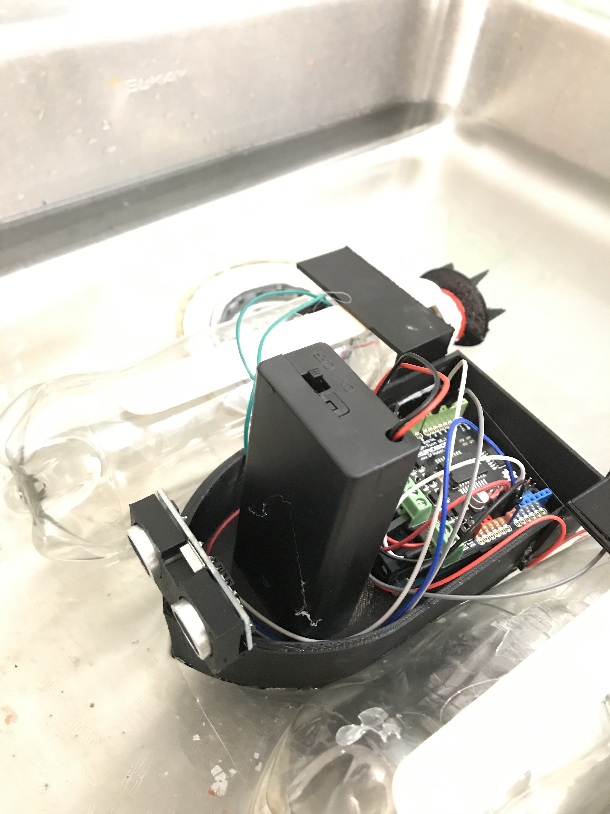
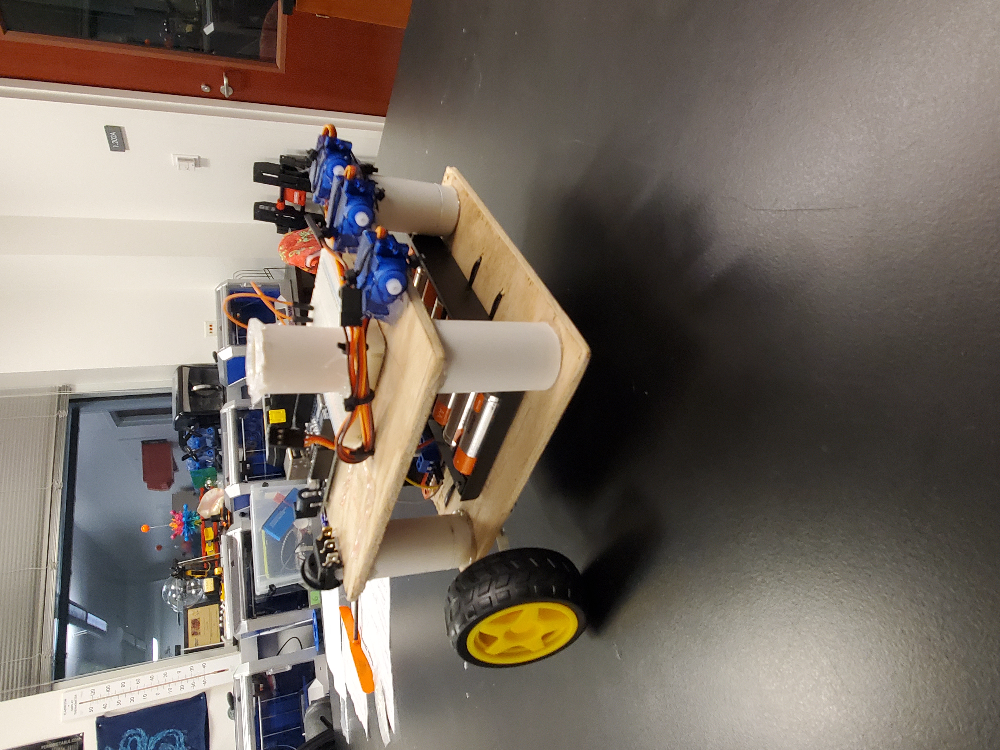
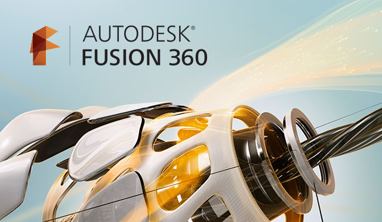
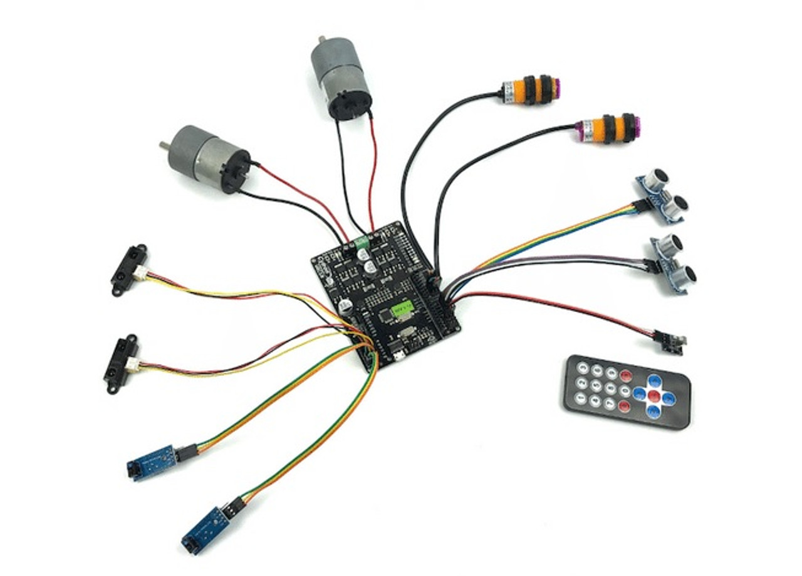

# FALL 2022 MAJOR WORKSHOPS

## Waterbot (3 Weeks)
\
Words Words Words \

## Sumobot Competition (8 Weeks)
\
More Words \

]
# REOCCURING WORKSHOPS

## Fusion 360 2D & 3D Basics
\
More Words \

## Arduino Microcontroller & IDE Basics
\
More Words \

## 3D Slicer & Printing Basics
\
More Words \

